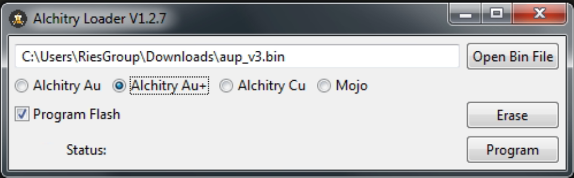

## Installing and building MicroFPGA

### Installing MicroFPGA

1. Download and install [AlchitryLabs](https://alchitry.com/alchitry-labs).

3. Download the [MicroFPGA configuration](https://github.com/mufpga/MicroFPGA/releases/tag/v3) corresponding to your FPGA board (Au, Au+ or Cu).

3. Start AlchitryLoader, select the .bin file correponding to your FPGA, select the correct board type and click on "Program".

   

4. MicroFPGA is ready to be used!

### Building MicroFPGA

In order to build MicroFPGA, the source code and FPGA builders must be installed.

1. Download and install [Git](https://git-scm.com/downloads).

2. Using the newly installed git console, clone the MicroFPGA repository in the folder of your choice:

   ```bash
   $ cd /path/to/folder/
   $ git clone https://github.com/mufpga/MicroFPGA.git
   ```

3. Follow the instructions in the [AlchtitryLabs](https://alchitry.com/alchitry-labs) page, *Builders* section, to install either Vivado (Au/Au+) or IceCube2 (Cu). 

4. Start AlchitryLabs and in the "Settings" menu, set the location of the compiling tools (Vivado or IceCube2).

5. In "Project", open the MicroFPGA project (*.alp file corresponding to the [Au](https://github.com/mufpga/MicroFPGA/tree/main/Au), [Au+](https://github.com/mufpga/MicroFPGA/tree/main/Au%2B) or [Cu](https://github.com/mufpga/MicroFPGA/tree/main/Cu) configuration) that was cloned in step 2. 

6. Click on the hammer icon to build the project. It can take a few minutes.

7. Once the project has finished, upload it to your board with the plain arrow (Flash memory).

8. The source code must be built after each modification.

