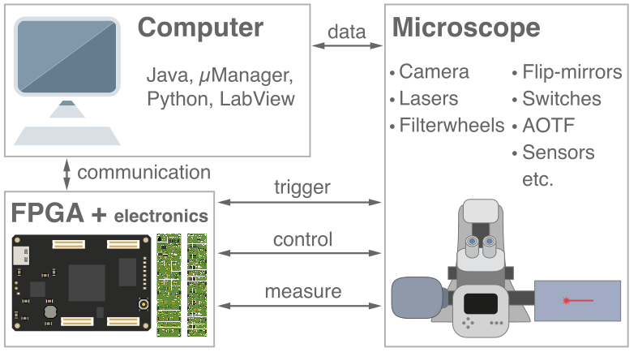

# MicroFPGA documentation

MicroFPGA is an FPGA-based platform for the electronic control of microscopes. It aims at using affordable FPGA to generate or read signals from a variety of devices, including cameras, lasers, servomotors, filter-wheels, etc. It can be controlled via [Micro-Manager](https://micro-manager.org/), or its [Java](https://github.com/mufpga/MicroFPGA-java), [Python](https://github.com/mufpga/MicroFPGA-py) and [LabView](https://github.com/mufpga/MicroFPGA-labview) communication libraries, and comes with optional complementary [electronics](https://github.com/mufpga/MicroFPGA-electronics).

## Content

1. [Principle](principle.md)
2. [Installation guide](installation.md)
3. [Resources](resources.md)
4. [Tutorials](tutorials.md)

## Related repositories

MicroFPGA is divided into multiple repositories:

- [FPGA configuration](https://github.com/mufpga/MicroFPGA)
- [Micro-Manager device adapter](https://github.com/mufpga/MicroFPGA-mm)
- [Java library](https://github.com/mufpga/MicroFPGA-java)
- [Python package](https://github.com/mufpga/MicroFPGA-py)
- [LabView library](https://github.com/mufpga/MicroFPGA-labview)
- [Complementary electronics](https://github.com/mufpga/MicroFPGA-electronics)

Additionally, MicroFPGA can be used together with other projects:

- [A Micro-Manager GUI](https://github.com/jdeschamps/htSMLM)
- [Ries lab repositories with compatible servomotor designs](https://github.com/ries-lab/RiesPieces)
- [A custom LaserEngine triggered by MicroFPGA](https://github.com/ries-lab/LaserEngine)

<!--- 
## Cite us

If you use MicroFPGA, please cite us:

 ---> 

## Contact

If you have any question, contact us via the [Image.sc](image.sc) forum (tag @jdeschamps or by PMs) or by email joran.deschamps[/at/]fht.org.

MicroFPGA and the Micro-Manager/Python/Java libraries were written by Joran Deschamps, EMBL (2020). The custom electronic boards and the LabView example were developed by Christian Kieser (Electronic Workshop, EMBL).