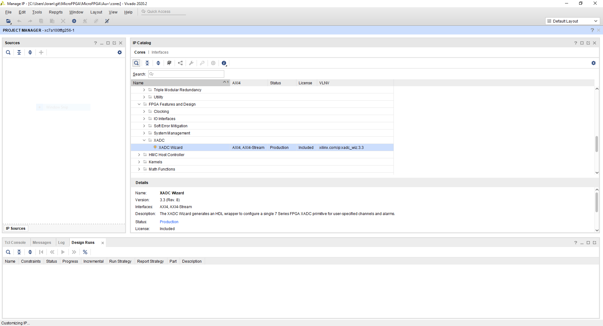
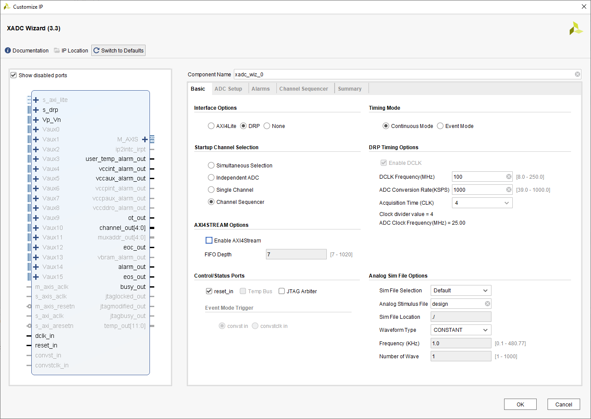
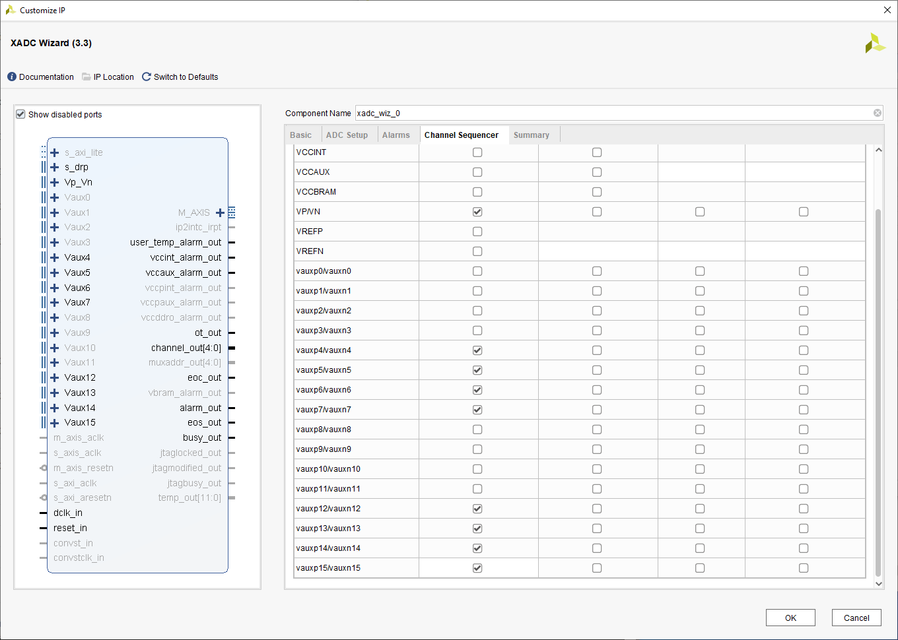
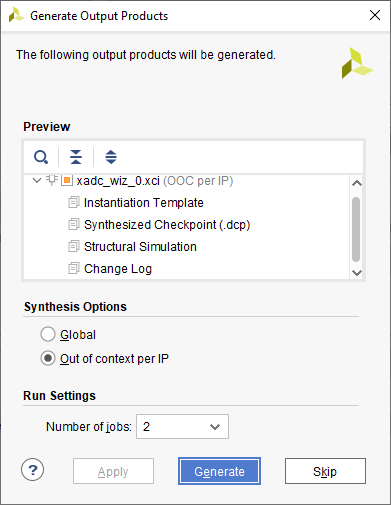

# Analog pins mapping

Here is a brief overview of the analog pins mapping, from the FPGA ADC schematic to the MicroFPGA channels numbers.

### Resources

- The [manual](https://www.xilinx.com/support/documentation/user_guides/ug480_7Series_XADC.pdf) for the Xilinx 7 series FPGA 12 bits ADC has a full description of the Au FPGA ADC. In particular, on page 38, the hexadecimal addresses are indicated (second column of the table).
- In the [Au FPGA schematic](https://cdn.shopify.com/s/files/1/2702/8766/files/alchitry_au_sch.pdf?1474573937723901827), the auxiliary analog channels that are not used can be found on Bank 35 (see page 1): ADXP/ADXN where X is the channel number. On page 2, the wiring of the banks are shown. Finally, on page 3, the dedicated analog channel (vp/vn) are indicated. 
- The [xadc constraint file](https://github.com/mufpga/MicroFPGA/blob/main/Au/constraint/xadc.xdc) attributes signals to specific pins.
- The [analog Lucid module](https://github.com/mufpga/MicroFPGA/blob/main/Au/source/analog.luc) maps the signals (xadc constraint) to the auxiliary channels (ADC).

Here is a summary table:

| **Channel** | **address  (hex)** | **address** | MicroFPGA channel | Pin (physical) | Pin (Br)    |
| ----------- | :---------------------: | :---------: | :---------------: | -------------- | :---------- |
| **Vaux 15** |           1fh           |     31      |     channel 7     | E2/D1          | BankB 3/2   |
| **Vaux 14** |           1eh           |     30      |     channel 6     | B2/A2          | BankB 6/5   |
| **Vaux 13** |           1dh           |     29      |     channel 5     | C7/C6          | BankB 27/28 |
| **Vaux 12** |           1ch           |     28      |     channel 4     | B6/B5          | BankB 21/20 |
| Vaux 11     |           1bh           |      -      |         -         | -              | -           |
| Vaux 10     |           1ah           |      -      |         -         | -              | -           |
| Vaux 9      |           19h           |      -      |         -         | -              | -           |
| Vaux 8      |           18h           |      -      |         -         | -              | -           |
| **Vaux 7**  |           17h           |     23      |     channel 3     | C1/B1          | BankB 48/49 |
| **Vaux 6**  |           16h           |     22      |     channel 2     | C3/C2          | BankB 45/46 |
| **Vaux 5**  |           15h           |     21      |     channel 1     | A5/A4          | BankB 18/17 |
| **Vaux 4**  |           14h           |     20      |     channel 0     | B7/A7          | BankB 24/23 |
| Vaux 3      |           13h           |      -      |         -         | -              | -           |
| Vaux 2      |           12h           |      -      |         -         | -              | -           |
| Vaux 1      |           11h           |      -      |         -         | -              | -           |
| Vaux 0      |           10h           |      -      |         -         | -              | -           |
| VP/VN       |           03h           |      3      |         -         | H8/J7          | BankD 31/30 |

The available auxiliary channels are indicated in bold. The second column is the hexadecimal addresses from the ADC manual. The "MicroFPGA channel" column indicates the numbering of the MicroFPGA channels, while the physical pins (Au schematic, page 1) and the corresponding bank pin (Au schematic, page 2) are stated in the last two columns.

Note that the dedicated analog channel (vp/vn) is currently not used in MicroFPGA.

### Setting up the XADC in AlchitryLabs

1. Click on "Project / Vivado IP Catalog"

2. After a time a window opens, in "IP Catalog", double click on "FPGA Features and Design / XADC / XADC Wizard".

   

3. In the newly opened window, select "Channel sequencer" in "Startup Channel Selection".

   

4. In "Channel Sequencer", enable Vaux 4, 5, 6, 7, 12, 13, 14 and 15.

   

5. Click "OK" and then "Generate".

   

6. Once the "Design Run" complete, close Vivado. The new core is added to the Alchitry project.