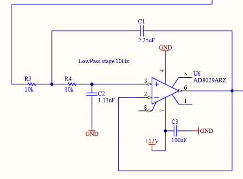

## Faster analog synchronization

The [AOTF-CB](https://github.com/mufpga/MicroFPGA-electronics/tree/main/AOTF_conversion_board) allows synchronizing an analog signal with a camera (active or passsive sync). The analog signal is generated by
low-pass filtering a PWM output.

Because the current version of the AOTF-CB has a 10 kHz cut-off, the response time of the
output analog signal is about 100 ms. This is too slow for synchronization in the time frame
of a single camera image (e.g. 10-200 ms for wide-field, about 1 ms for light-sheet).

In order to obtain faster synchronization, the design of the AOTF-CB needs to be slightly
altered.

> **Important**: the AOTF-CB needs to be updated prior to ordering!

### Current design

On page 5 of [details.pdf](https://github.com/mufpga/MicroFPGA-electronics/blob/main/AOTF_conversion_board/Details.PDF), you can find the Sallen-Key circuit used to low-pass the PWM signal.

Using an [online calculator](https://daycounter.com/Filters/Sallen-Key-LP-Calculator.phtml), you can
compute the capacitor values required to low-pass at the correct frequency.

In our case, with a 3dB frequency cut-off of 10 Hz, a 10 kOhms resisotr, 2 poles and a Butterworth type, we
obtain the following values:

|   Capacitor  |         Value         |
| :----------: | :-------------------: |
|      C1      |  2.2519756170533E-6 F |
|      C2      |  1.1259662120805E-6 F |

These correspond to C1 and C2 from the figure above.

MicroFPGA PWM have a period of 1.3 ms, which means that they repeat at a frequency of about
770 Hz. In order to obtain good performances with the low-pass circuit, about an order of
magnitude faster PWM is a good rule of thumbs.

### Faster synchronization

In order to have updates of on the scale of 0.1 ms, we would need a low-pass filter with
a cut-off around 10 kHz. Using the previous online calculator, we get:

|   Capacitor  |         Value         |
| :----------: | :-------------------: |
|      C1      |  2.2519756170533E-9 F |
|      C2      |  1.1259662120805E-9 F |

Which are a 3 order of magnitudes smaller capacitance. Note that the resistor can also be changed, which
will impact the values of the capacitors.

Change the board design before ordering the board. Finally, you need to decrease the PWM period. Check out the corresponding tutorial ([Change PWM period](tuto6b_pwm.md)).
